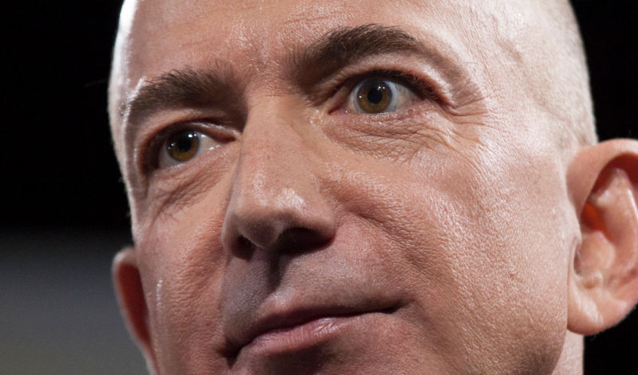

# Bezos Presence

## Discord Integration for Amazon Music (and other things)
Ever wanted to tell the world that you use Amazon Music? Absolutely not? Well, now you can!

## Installation
Much like its namesake, Bezos Presence is a snake. Go get [Python 3](https://www.python.org/downloads/). 

Cool, now download [this thing](https://github.com/willf668/bezos-presence/archive/refs/heads/main.zip) and then run this command in the computer thing:
    
    pip install -r requirements.txt

Oh, and if you're on MacOS, you probably already use Apple Music or Spotify. Also, it doesn't work there yet soooooo...

Also, if you're on Linux, why the hell are you looking at this? Richard Stallman is ashamed of you and you should feel bad. Go back to VLC media player and rejoice in OSS.

## Usage
Do the code:

    python bezos.py

There's also an auto-generated settings file that you can edit! We love settings! Yay!

## If you're clinically insane and actually want this to run in the background:

Windows: add the included `launcher.vbs` [to startup](https://chaha0s.medium.com/how-to-run-python-script-in-background-automatically-on-windows-startup-b558d6b1f439)

Linux: [much easier](https://stackoverflow.com/questions/24518522/run-python-script-at-startup-in-ubuntu)

## Credits
Made with great hatred by [Will Farhat](willfarhat.com)

(ironically, this actually works quite well as a catch-all audio plugin beyond just amazon. i don't know how to feel about that.)